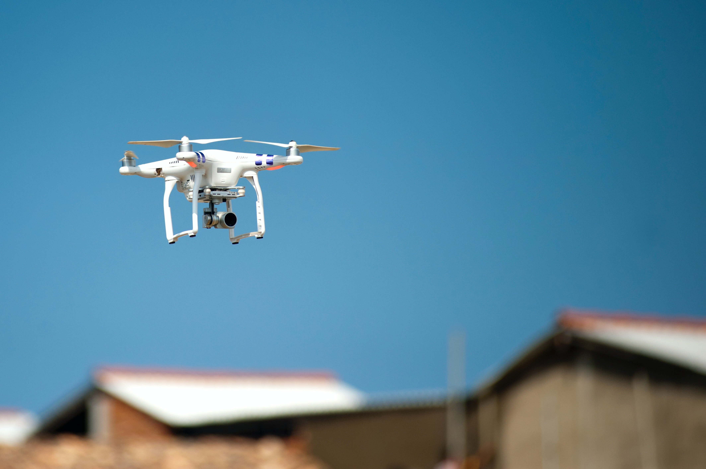

##   Visual Servoing 
 

### Introduction
Visual servoing is controlling the motion of robot using a vision sensor or robot. What we mean by this is that given a target image and current image, we want to generate a sequence of velocity commands that takes us to the target image.

Visual servoing aims to provide an abstraction layer, so that we can provide images as goal to the robot and ask it to move, instead of explicit 3D coordinates. This abstraction is particularly interesting because it maps direct image measurements from the environment to action, instead of requiring an intermeditate co-ordinate systems which depend on the frame. The amount of possibilities that this kind of abstraction opens up is amazing. We humans also tend to think and move in image space. Visual servoing covers the moving part. If we can combine this servoing with imagination, we will have a fully autonomous robot based on just vision sensor.  

### Image Based Visual Servoing (IBVS).

### MPC Based Visual Servoing.
---
