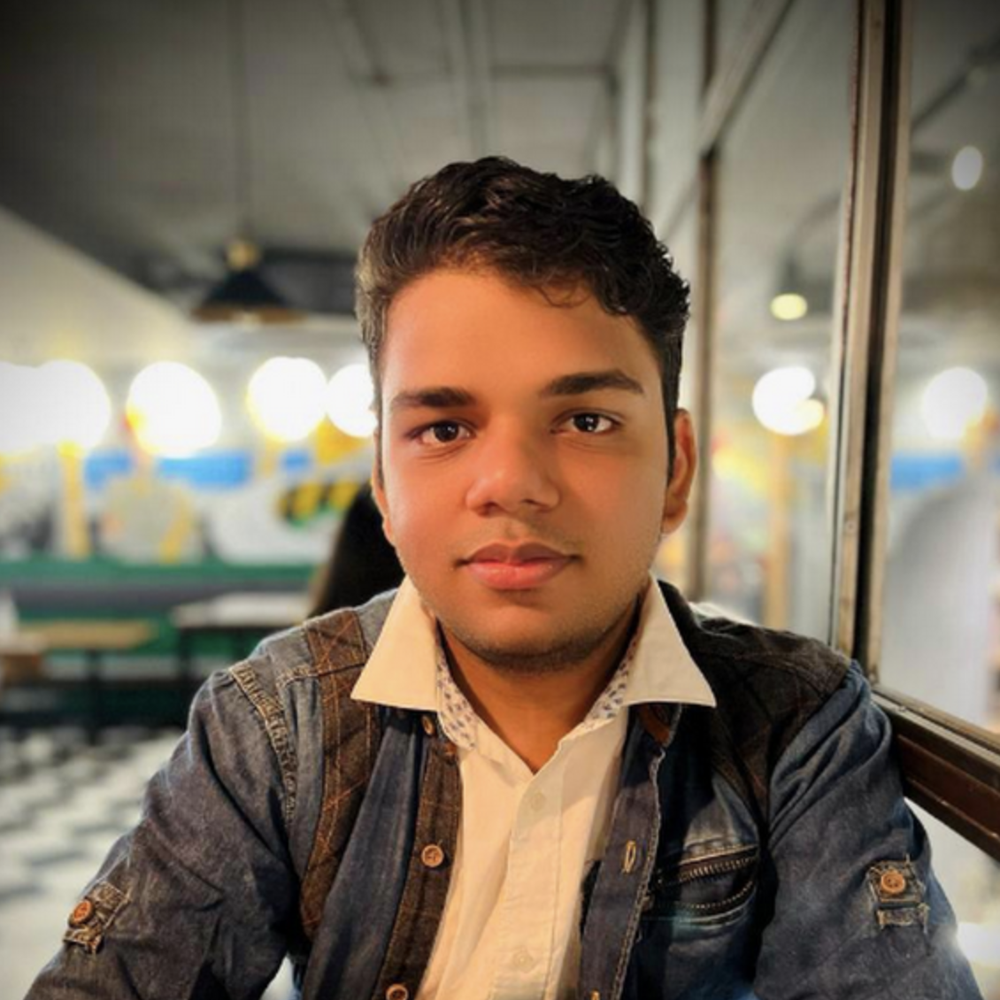

## About Me 

    <!-- Container for Image and Links -->
    

        <!-- Image at the Top -->
        
        
        <!-- Links Below Image -->
        

            <a href="./resume.pdf">CV</a> |
            <a href="https://scholar.google.com/citations?view_op=list_works&hl=en&authuser=1&hl=en&user=ZmVf8kUAAAAJ&sortby=pubdate&authuser=1">Google Scholar</a> |
            <a href="https://www.linkedin.com/in/qureshinomaan/">Linkedin</a> |
            <a href="https://github.com/qureshinomaan">Github</a> |
                <a href="mailto:nqafzal@gmail.com">Email</a>
            

            
    <!-- Other links ... -->
    <!-- Twitter Follow Button -->
    <a href="https://twitter.com/qunomaan?ref_src=twsrc%5Etfw" class="twitter-follow-button" data-show-count="false">Follow @qunomaan</a>
    

        

    

    <!-- Text Content to the Right -->
    

        <!-- Text filling up the space -->
        

            
Hi! I am a second-year MS Robotics student at Carnegie Mellon University advised by <a href="https://www.ri.cmu.edu/ri-faculty/george-a-kantor/">Prof. George Kantor</a> and <a href="https://www.abhisilwal.com">Prof. Abhisesh Silwal</a>. I also collaborate with <a href="https://davheld.github.io">Prof. David Held</a> and <a href="https://www.ri.cmu.edu/ri-people/francisco-yandun/">Dr. Francisco Yandun</a>. I am interested in machine learning for robot manipulation. Currently, I am working on <a href="https://splatsim.github.io">SplatSim</a> and deploying robots using it to actual agricultural fields helping farmers. 

            
 Before that, I completed my integrated BS degree from IIIT Hyderabad. I was an undergraduate researcher at Robotics Research Center, advised by Prof. <a href="https://scholar.google.co.in/citations?user=QDuPGHwAAAAJ&hl=en">K. Madhava Krishna.</a> I spent my summers of 2021 and 2022 working with Prof. David Held at Carnegie Mellon University. I formulated a differentiable version of linear dynamic systems, which could be used as a building block to accelerate the learning and transfer of policies. I also collaborated with <a href="https://makarandtapaswi.github.io">Prof. Makarand Tapaswi</a> on a project that aims to learn manipulation policies directly from human demonstrations like <a href="https://paperswithcode.com/dataset/something-something-v2">these.</a>

            
If you're looking for collaborators for Robotics/ML projects, please feel free to get in touch!

            
            <!-- More text about you... -->
        

    

## research
I want to solve robot manipulation. While most animals can walk or run, very few can manipulate their environments like humans do. There is an inherent simplicity yet profound intrigue in manipulation problems that captivates me. 

## news

  <ul>
<li>Sep 15, 2024: Submitted <a href="https://splatsim.github.io">SplatSim</a>  to ICRA 2025!</li>
<li>Jun 30, 2024: Imagine2Servo accepted at IROS 2024!</li>
<li>Sep 09, 2023: Teaching Assistant for <a href="https://16-831.github.io/fall23/">Robot Learning Course</a>!</li>
<li>Sep 09, 2023: Our paper on time-based inductive bias for RL policies got accepted to an IROS Workshop!</li>
<li>Aug 14, 2023: Started MS Robotics at CMU!</li>
<li>Apr 07, 2023: Our paper on data-driven inverse kinematics got accepted to IJCNN, 2023!</li>
<li>Jun 30, 2022: Our <a href="https://arxiv.org/pdf/2208.01960.pdf">paper</a> on skill learning using differentiable physics has been accepted for presentation at IROS, 2022!</li>
<li>May 26, 2022: Our <a href="https://sites.google.com/view/monocular-obstacle/home">paper</a> on Monocular Obstacle Avoidance got accepted to CASE,2022!</li>
<li>Jan 29, 2022: Our <a href="https://openreview.net/forum?id=rF-fT4pN1Wc&referrer=%5Bthe%20profile%20of%20Mohammad%20Nomaan%20Qureshi%5D">paper</a> on sequenced dynamical systems got accepted to GPL Workshop at ICLR, 2022!</li>
<li>Jun 30, 2021: Our work on Real Time Visual Servoing has been accepted for presentation at IROS,2021!</li>
<li>May 05, 2021: Started my internship at <a href="https://r-pad.github.io">R-PAD</a>, Carnegie Mellon University!</li>
<li>May 02, 2020: Started working at <a href="https://robotics.iiit.ac.in">Robotics Research Center</a>!</li>
  </ul>

## Publications

Representative publications are highlighted. 
( "\*" denotes equal contribution. )



  

    
  

  

    <h3><a href="{{ pub.paper_link }}">{{ pub.title }}</a></h3>
    
{{ pub.authors | replace: 'M Nomaan Qureshi', '<strong style="color: #ff6347;">M Nomaan Qureshi</strong>' }}

    
{{ pub.venue }}, {{ pub.year }}

    

      <a href="{{ pub.paper_link }}">Paper</a>
       | <a href="{{ pub.video_link }}">Video</a>
       | <a href="{{ pub.code_link }}">Code</a>
      | <a href="javascript:void(0);" onclick="toggleInfo('info{{ forloop.index }}')">Why?</a>
      | <a href="javascript:void(0);" onclick="toggleInfo('contribution{{ forloop.index }}')">Contribution</a>
      | <a href="javascript:void(0);" onclick="toggleInfo('bib{{ forloop.index }}')">Bibtex</a>
    

    

      
{{ pub.explanation }}

    

    

      
{{ pub.contribution }}

    

    

      <pre><code>{{ pub.bibtex | escape }}</code></pre>
    

  



## Contact
Please feel free to contact or interact with me through the following links:

* Email: nqafzal [at] gmail
* Google Scholar: [M. Nomaan Qureshi](https://scholar.google.com/citations?user=ZmVf8kUAAAAJ&hl=en)
* Twitter: [@qunomaan](https://twitter.com/qunomaan)
* GitHub: [qureshinomaan](github.com/qureshinomaan)





